### Работа с уровнями изоляции транзакции в PostgreSQL

```text
Цель:
научиться управлять уровнем изоляции транзации в PostgreSQL 
и понимать особенность работы уровней read commited и repeatable read.
```

1. PostgreSQL поднят в докере.
2. Создана БД otus.
3. Открыты две сессии - два терминала.
4. В обеих сессиях отключён autocommit.

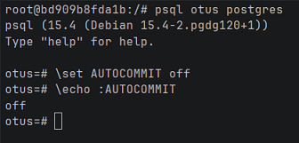

5. В первой сессии создана и заполнена таблица `persons`:

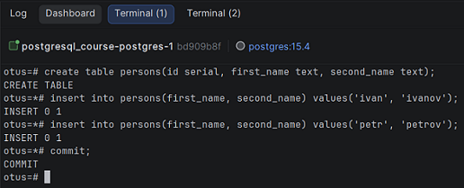

6. Результаты выполнения команд в разных сессиях:

* посмотреть текущий уровень изоляции: `show transaction isolation level`

| Сессия 1                                      | Сессия 2                                      |
|-----------------------------------------------|-----------------------------------------------|
| 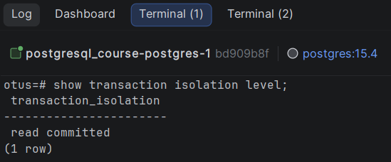 | 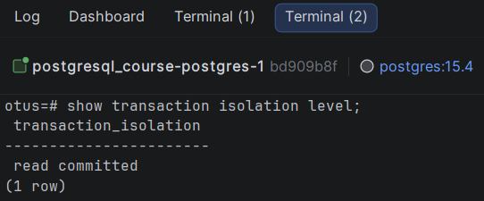 |

* начать новую транзакцию в обеих сессиях с дефолтным (не меняя) уровнем изоляции

* в первой сессии добавить новую запись `insert into persons(first_name, second_name) values('sergey', 'sergeev');`

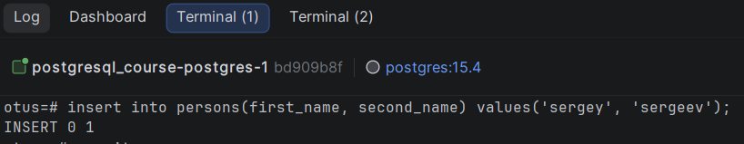
* сделать `select * from persons;` во второй сессии

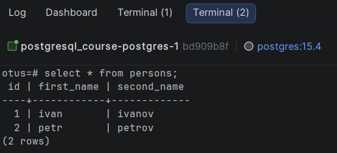

* видите ли вы новую запись и если да то почему?
```text
  Нет.
  Новой записи в сессии 2 нет, т.к. данные в первой сессии не были закоммичены до начала запроса и уровень изоляции read committed.
  В транзакции, работающей на этом уровне, select видит только те данные, которые были зафиксированы до начала запроса; 
  select не увидит незафиксированных изменений, внесённых параллельными транзакциями в процессе выполнения запроса.
```
* завершить первую транзакцию - `commit;`
* сделать `select * from persons` во второй сессии

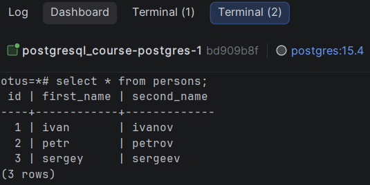
* видите ли вы новую запись и если да то почему?
```text
Да.
При уровне изоляции read committed два последовательных оператора SELECT могут получать разные данные в рамках одной транзакции, 
если какие-то другие транзакции зафиксируют изменения после запуска первого SELECT, но до запуска второго.
```
* завершите транзакцию во второй сессии
* начать новые но уже repeatable read транзации - `set transaction isolation level repeatable read;`

| Сессия 1                                        | Сессия 2                                        |
|-------------------------------------------------|-------------------------------------------------|
| 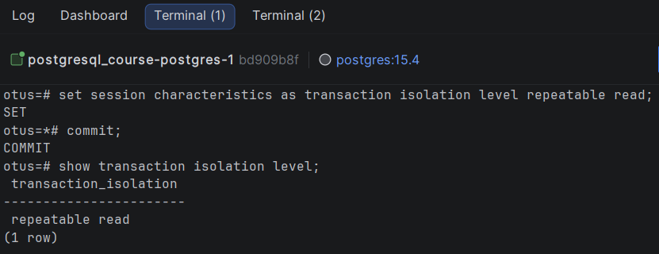 | 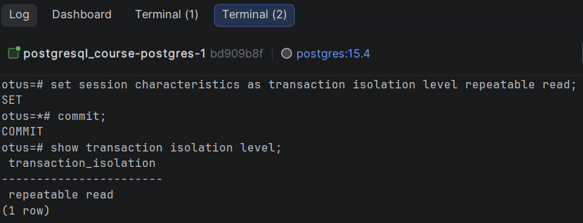 |

* в первой сессии добавить новую запись `insert into persons(first_name, second_name) values('sveta', 'svetova');`

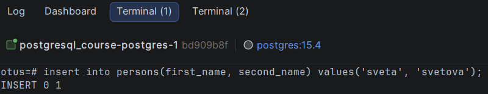
* сделать `select * from persons` во второй сессии

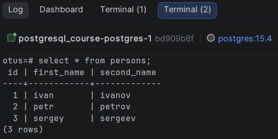
* видите ли вы новую запись и если да то почему?
```text
Нет.
Главная причина в том, что транзакция во второй сессии началась после транзакции в первой сессии.

В режиме Repeatable Read видны только те данные, которые были зафиксированы до начала транзакции, 
но не видны незафиксированные данные и изменения, произведённые другими транзакциями в процессе выполнения данной транзакции.
```
* завершить первую транзакцию - `commit;`
* сделать `select * from persons` во второй сессии

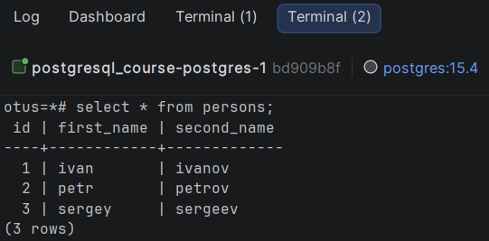
* видите ли вы новую запись и если да то почему?
```text
Нет.
Транзакция во второй сессии началась ещё до коммита в первой сессии. Поэтому изменений нет.

В режиме Repeatable Read видны только те данные, которые были зафиксированы до начала транзакции, 
но не видны незафиксированные данные и изменения, произведённые другими транзакциями в процессе выполнения данной транзакции.
```
* завершить вторую транзакцию
* сделать `select * from persons` во второй сессии

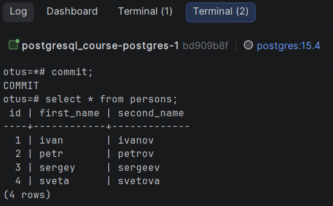
* видите ли вы новую запись и если да то почему?
```text
Да.
Эта транзакция второй сессии началась уже после коммита в первой сессии. Поэтому изменения уже видны.

В режиме Repeatable Read видны только те данные, которые были зафиксированы до начала транзакции, 
но не видны незафиксированные данные и изменения, произведённые другими транзакциями в процессе выполнения данной транзакции.
```