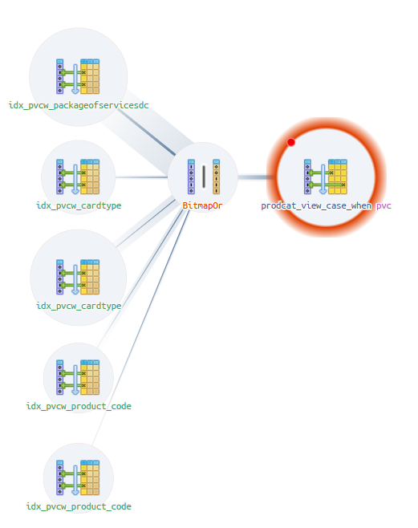
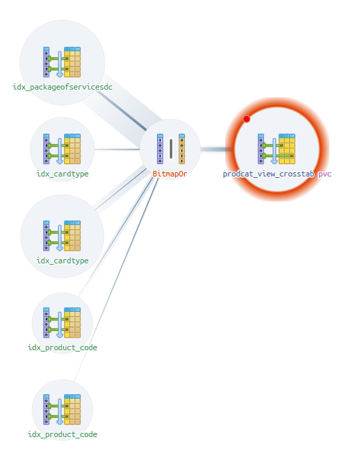

# PIVOT-преобразования. Оптимизация запросов

## Запросы без индексов

Выполним запросы без создания дополнительных индексов для MATERIALIZED VIEW.
Для этого закомментируем строку `execute idx_query;` в процедурах 
`create_view_dynamic_case_when()` и `create_view_dynamic_crosstab()`, и пересоздадим их.

Запрос для подходов CASE WHEN и для CROSSTAB будет идентичным (изменится только таблица для выборки).
Сформируем пример запроса для получения продуктов по нескольким условиям:

```sql
explain analyze
select
    pvc.*
from
    -- Для CASE WHEN prodcat_view_case_when pvc
    -- Для CASE WHEN prodcat_view_crosstab pvc
    prodcat_view_case_when pvc
where
    pvc.product_group_code in ('1702', '0301')
  and (
    (
        -- все продукты, у которых packageofservicesdc содержит два значения 
        pvc.packageofservicesdc @> array['PRIVILEGE2', 'MULTICARTA']
        )
        or
    (
        -- все продукты, у которых cardtype равен 'MCURR_MRMGCOB' и isdebit равен 'true'
        pvc.cardtype @> array['MCURR_MRMGCOB'] and pvc.isdebit @> array['true']
        )
        or
    (
        -- все продукты, у которых cardtype равен 'MCURR_MRDB'
        pvc.cardtype @> array['MCURR_MRDB']
        )
        -- все продукты, у которых код равен '4DC003499' или '4DC003482'
        or pvc.code ='4DC003499'
        or pvc.code='4DC003482'
    );
```

Для JSON запрос будет иметь вид:
```sql
explain analyze
select
    pv.product_code,
    pv.attributes,
    pv.product_group_code,
    pv.product_name,
    pv.product_status 
from
    prodcat_view pv 
where
    pv.product_group_code in ('1702', '0301') 
    and (
        (
            pv.attributes @@ cast('($.packageofservicesdc == "PRIVILEGE2" && $.packageofservicesdc == "MULTICARTA")' as jsonpath)
        ) 
        or (
            pv.attributes @@ cast('($.cardtype == "MCURR_MRMGCOB" && $.isdebit like_regex "true" flag "i")' as jsonpath)
        ) 
        or (
            pv.attributes @@ cast('($.cardtype == "MCURR_MRDB")' as jsonpath)
        ) 
        or pv.product_code='4DC003499' 
        or pv.product_code='4DC003482'
    );
```

Для CASE WHEN получаем результат **4.538 ms**:
```sql
Seq Scan on prodcat_view_case_when pvc  (cost=0.00..1214.26 rows=211 width=1842) (actual time=0.011..4.513 rows=213 loops=1)
  Filter: (((product_group_code)::text = ANY ('{1702,0301}'::text[])) AND (((packageofservicesdc @> '{PRIVILEGE2,MULTICARTA}'::text[]) AND (cardtype @> '{MCURR_MRNSK22002416}'::text[])) OR ((cardtype @> '{MCURR_MRMGCOB}'::text[]) AND (isdebit @> '{true}'::text[])) OR (cardtype @> '{MCURR_MRDB}'::text[]) OR ((code)::text = '4DC003499'::text) OR ((code)::text = '4DC003482'::text)))
  Rows Removed by Filter: 4129
Planning Time: 0.261 ms
Execution Time: 4.538 ms
```

Для CROSSTAB получаем результат **3.233 ms**:
```sql
Seq Scan on prodcat_view_crosstab pvc  (cost=0.00..901.40 rows=415 width=2407) (actual time=0.008..3.204 rows=457 loops=1)
  Filter: ((product_group_code = ANY ('{1702,0301}'::text[])) AND ((packageofservicesdc @> '{PRIVILEGE2,MULTICARTA}'::text[]) OR ((cardtype @> '{MCURR_MRMGCOB}'::text[]) AND (isdebit @> '{true}'::text[])) OR (cardtype @> '{MCURR_MRDB}'::text[]) OR (code = '4DC003499'::text) OR (code = '4DC003482'::text)))
  Rows Removed by Filter: 3885
Planning Time: 0.155 ms
Execution Time: 3.233 ms
```

Для JSON получаем результат **4.798 ms**:
```sql
Seq Scan on prodcat_view pv  (cost=0.00..772.65 rows=581 width=1115) (actual time=0.009..4.771 rows=457 loops=1)
  Filter: (((product_group_code)::text = ANY ('{1702,0301}'::text[])) AND ((attributes @@ '($."packageofservicesdc" == "PRIVILEGE2" && $."packageofservicesdc" == "MULTICARTA")'::jsonpath) OR (attributes @@ '($."cardtype" == "MCURR_MRMGCOB" && $."isdebit" like_regex "true" flag "i")'::jsonpath) OR (attributes @@ '($."cardtype" == "MCURR_MRDB")'::jsonpath) OR ((product_code)::text = '4DC003499'::text) OR ((product_code)::text = '4DC003482'::text)))
  Rows Removed by Filter: 3889
Planning Time: 0.179 ms
Execution Time: 4.798 ms
```

## Запросы с индексами

Создадим индексы для MATERIALIZED VIEW.
Раскомментируем строку `execute idx_query;` в процедурах
`create_view_dynamic_case_when()` и `create_view_dynamic_crosstab()`, и пересоздадим их.

Для CASE WHEN получаем результат **0.869 ms**:
```sql
Bitmap Heap Scan on prodcat_view_case_when pvc  (cost=40.10..842.94 rows=395 width=1842) (actual time=0.129..0.814 rows=457 loops=1)
  Recheck Cond: ((packageofservicesdc @> '{PRIVILEGE2,MULTICARTA}'::text[]) OR (cardtype @> '{MCURR_MRMGCOB}'::text[]) OR (cardtype @> '{MCURR_MRDB}'::text[]) OR ((code)::text = '4DC003499'::text) OR ((code)::text = '4DC003482'::text))
  Filter: (((product_group_code)::text = ANY ('{1702,0301}'::text[])) AND ((packageofservicesdc @> '{PRIVILEGE2,MULTICARTA}'::text[]) OR ((cardtype @> '{MCURR_MRMGCOB}'::text[]) AND (isdebit @> '{true}'::text[])) OR (cardtype @> '{MCURR_MRDB}'::text[]) OR ((code)::text = '4DC003499'::text) OR ((code)::text = '4DC003482'::text)))
  Heap Blocks: exact=389
  ->  BitmapOr  (cost=40.10..40.10 rows=405 width=0) (actual time=0.094..0.096 rows=0 loops=1)
        ->  Bitmap Index Scan on idx_pvcw_packageofservicesdc  (cost=0.00..13.46 rows=194 width=0) (actual time=0.059..0.059 rows=291 loops=1)
              Index Cond: (packageofservicesdc @> '{PRIVILEGE2,MULTICARTA}'::text[])
        ->  Bitmap Index Scan on idx_pvcw_cardtype  (cost=0.00..8.01 rows=2 width=0) (actual time=0.005..0.005 rows=2 loops=1)
              Index Cond: (cardtype @> '{MCURR_MRMGCOB}'::text[])
        ->  Bitmap Index Scan on idx_pvcw_cardtype  (cost=0.00..9.55 rows=207 width=0) (actual time=0.017..0.018 rows=207 loops=1)
              Index Cond: (cardtype @> '{MCURR_MRDB}'::text[])
        ->  Bitmap Index Scan on idx_pvcw_product_code  (cost=0.00..4.29 rows=1 width=0) (actual time=0.009..0.009 rows=1 loops=1)
              Index Cond: ((code)::text = '4DC003499'::text)
        ->  Bitmap Index Scan on idx_pvcw_product_code  (cost=0.00..4.29 rows=1 width=0) (actual time=0.003..0.003 rows=1 loops=1)
              Index Cond: ((code)::text = '4DC003482'::text)
Planning Time: 0.676 ms
Execution Time: 0.869 ms
```



Для CROSSTAB получаем результат **0.712 ms**:
```sql
Bitmap Heap Scan on prodcat_view_crosstab pvc  (cost=40.28..734.21 rows=415 width=2407) (actual time=0.129..0.673 rows=457 loops=1)
  Recheck Cond: ((packageofservicesdc @> '{PRIVILEGE2,MULTICARTA}'::text[]) OR (cardtype @> '{MCURR_MRMGCOB}'::text[]) OR (cardtype @> '{MCURR_MRDB}'::text[]) OR (code = '4DC003499'::text) OR (code = '4DC003482'::text))
  Filter: ((product_group_code = ANY ('{1702,0301}'::text[])) AND ((packageofservicesdc @> '{PRIVILEGE2,MULTICARTA}'::text[]) OR ((cardtype @> '{MCURR_MRMGCOB}'::text[]) AND (isdebit @> '{true}'::text[])) OR (cardtype @> '{MCURR_MRDB}'::text[]) OR (code = '4DC003499'::text) OR (code = '4DC003482'::text)))
  Heap Blocks: exact=361
  ->  BitmapOr  (cost=40.28..40.28 rows=426 width=0) (actual time=0.088..0.093 rows=0 loops=1)
        ->  Bitmap Index Scan on idx_packageofservicesdc  (cost=0.00..13.61 rows=215 width=0) (actual time=0.056..0.056 rows=291 loops=1)
              Index Cond: (packageofservicesdc @> '{PRIVILEGE2,MULTICARTA}'::text[])
        ->  Bitmap Index Scan on idx_cardtype  (cost=0.00..8.02 rows=2 width=0) (actual time=0.004..0.004 rows=2 loops=1)
              Index Cond: (cardtype @> '{MCURR_MRMGCOB}'::text[])
        ->  Bitmap Index Scan on idx_cardtype  (cost=0.00..9.55 rows=207 width=0) (actual time=0.016..0.017 rows=207 loops=1)
              Index Cond: (cardtype @> '{MCURR_MRDB}'::text[])
        ->  Bitmap Index Scan on idx_product_code  (cost=0.00..4.29 rows=1 width=0) (actual time=0.008..0.008 rows=1 loops=1)
              Index Cond: (code = '4DC003499'::text)
        ->  Bitmap Index Scan on idx_product_code  (cost=0.00..4.29 rows=1 width=0) (actual time=0.003..0.003 rows=1 loops=1)
              Index Cond: (code = '4DC003482'::text)
Planning Time: 0.483 ms
Execution Time: 0.712 ms
```



Для JSON создадим индексы
```sql
CREATE INDEX idxgin_attributes ON prodcat_view USING gin (attributes jsonb_path_ops);
CREATE INDEX ix_product_code_v ON prodcat_view USING btree (product_code);
```

Согласно документации postgresql:
```text
Класс операторов jsonb_path_ops поддерживает только запросы с операторами @>, @? и @@, 
но он значительно производительнее класса по умолчанию jsonb_ops. 
Индекс jsonb_path_ops обычно гораздо меньше индекса jsonb_ops для тех же данных и более точен при поиске, 
особенно если запросы обращаются к ключам, часто встречающимся в данных. 
Таким образом, с ним операции поиска выполняются гораздо эффективнее, чем с классом операторов по умолчанию.
```

и получим результат **0.642 ms**
```sql
Bitmap Heap Scan on prodcat_view pv  (cost=57.81..748.60 rows=581 width=1115) (actual time=0.085..0.608 rows=457 loops=1)
  Recheck Cond: ((attributes @@ '($."packageofservicesdc" == "PRIVILEGE2" && $."packageofservicesdc" == "MULTICARTA")'::jsonpath) OR (attributes @@ '($."cardtype" == "MCURR_MRMGCOB" && $."isdebit" like_regex "true" flag "i")'::jsonpath) OR (attributes @@ '($."cardtype" == "MCURR_MRDB")'::jsonpath) OR ((product_code)::text = '4DC003499'::text) OR ((product_code)::text = '4DC003482'::text))
  Filter: ((product_group_code)::text = ANY ('{1702,0301}'::text[]))
  Heap Blocks: exact=130
  ->  BitmapOr  (cost=57.81..57.81 rows=602 width=0) (actual time=0.068..0.069 rows=0 loops=1)
        ->  Bitmap Index Scan on idxgin_attributes  (cost=0.00..22.57 rows=343 width=0) (actual time=0.043..0.043 rows=291 loops=1)
              Index Cond: (attributes @@ '($."packageofservicesdc" == "PRIVILEGE2" && $."packageofservicesdc" == "MULTICARTA")'::jsonpath)
        ->  Bitmap Index Scan on idxgin_attributes  (cost=0.00..12.00 rows=1 width=0) (actual time=0.002..0.002 rows=2 loops=1)
              Index Cond: (attributes @@ '($."cardtype" == "MCURR_MRMGCOB" && $."isdebit" like_regex "true" flag "i")'::jsonpath)
        ->  Bitmap Index Scan on idxgin_attributes  (cost=0.00..13.93 rows=257 width=0) (actual time=0.012..0.012 rows=207 loops=1)
              Index Cond: (attributes @@ '($."cardtype" == "MCURR_MRDB")'::jsonpath)
        ->  Bitmap Index Scan on ix_product_code_v  (cost=0.00..4.29 rows=1 width=0) (actual time=0.009..0.009 rows=1 loops=1)
              Index Cond: ((product_code)::text = '4DC003499'::text)
        ->  Bitmap Index Scan on ix_product_code_v  (cost=0.00..4.29 rows=1 width=0) (actual time=0.002..0.002 rows=1 loops=1)
              Index Cond: ((product_code)::text = '4DC003482'::text)
Planning Time: 0.212 ms
Execution Time: 0.642 ms
```


## Итого
Запросы при разных подходах выполняются в сравнительно одинаковое время 0.6-0.8 мс.

Все планы посторения запросов одинаковы.
Используется битовая карта.

Из докумнтации postgreSQL:

```text
Выполняя объединение нескольких индексов, система сканирует все необходимые индексы и создаёт в памяти битовую карту расположения строк таблицы, которые удовлетворяют условиям каждого индекса. 
Затем битовые карты объединяются операциями AND и OR, как того требуют условия в запросе. 
Наконец система обращается к соответствующим отмеченным строкам таблицы и возвращает их данные. 
Строки таблицы просматриваются в физическом порядке, как они представлены в битовой карте; 
это означает, что порядок сортировки индексов при этом теряется и в запросах с предложением ORDER BY сортировка будет выполняться отдельно. 
```

